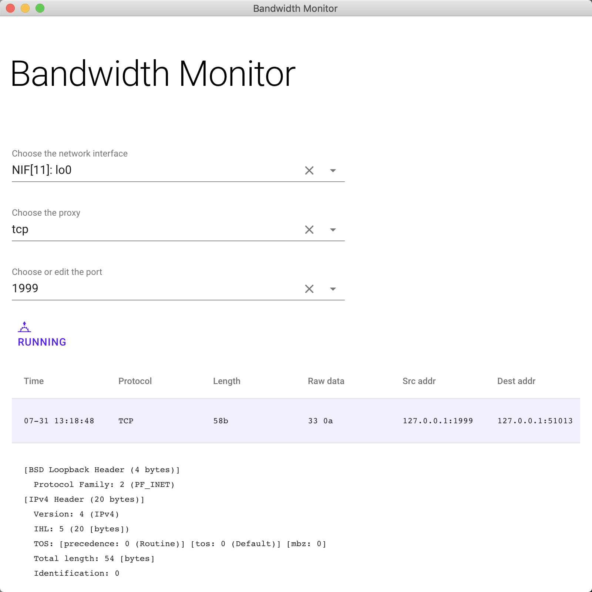

```text
  __  __             _ _             
 |  \/  |           (_) |            
 | \  / | ___  _ __  _| |_ ___  _ __ 
 | |\/| |/ _ \| '_ \| | __/ _ \| '__|
 | |  | | (_) | | | | | || (_) | |   
 |_|  |_|\___/|_| |_|_|\__\___/|_|   
```

A demo vaadin-electron project that monitors TCP packet.

You can use this to learn about how to :
1. build UI with vaadin platform
2. bring Spring Boot into vaadin to take all the benefits of Spring into vaadin UI building process
(and drawbacks sometimes)
3. deal with TCP/UDP packet
4. build a distributed app with Electron and Java

There is a bug in this project and it's been solved in vaadin/flow :
[Another IndexOutOfBoundsException in NodeList.adjustChanges](https://github.com/vaadin/flow/issues/5843#issuecomment-511360813)

## Interface
